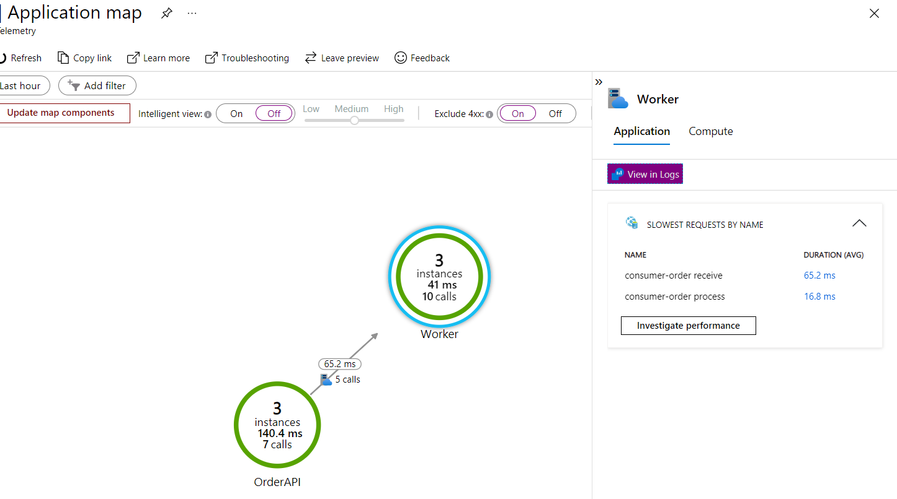

# Azure Monitor OpenTelemetry
+ Using OpenTelemetry Collector and send logs to Azure Monitor on local

## Goals
+ Integrate OpenTelemetry for tracing and metrics between services
    - Using TraceContextPropagator
+ Azure Monitor


### Usage docker-compose.yml file
+ Using otel collector for collection and sending logging
+ Add instrumentation_key into otel-collector-config.yml
+ Run on local
    ```
    docker-compose up
    ```

### Minikube: send directly log to the Azure Monitor
+ Replace AzureServiceBus and IntrumentionKey in devops/k8s/*.yml file
+ Expose Order API
```
minikube service --url order-api
```

### Results
+ 
+ 
+ 

### References
---------------
+ [OpenTelemetry Collector and Azure Monitor](https://purple.telstra.com/blog/dotnet--opentelemetry-collector--and-azure-monitor)
+ [Open Telemetry and Azure Monitor Trace Explorer](https://tech.playgokids.com/open-telemetry-azure-monitor-trace-exporter/)
