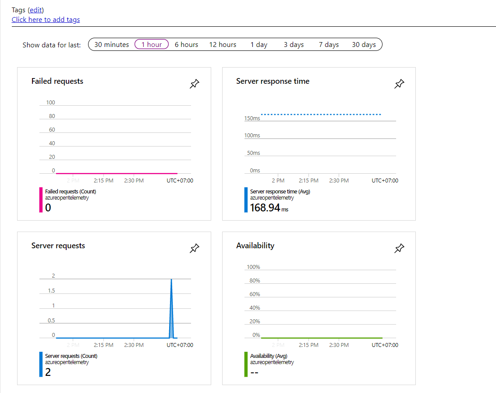
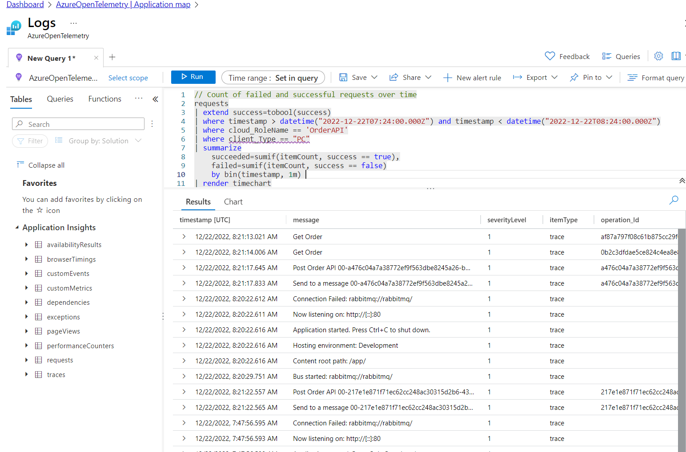

# Azure Monitor OpenTelemetry
+ Using OpenTelemetry Collector and send logs to Azure Monitor on local

## Goals
+ Integrate OpenTelemetry for tracing and metrics between services
    - Using TraceContextPropagator
+ Azure Monitor


### Usage


### Apply Terraform
+ Init Infrastructure
    ```
    terraform init
    terraform apply
    ```

+ Terraform will create a role name with aws-load-balancer-controller name
    + It creates a service account(aws-load-balancer-controller)
    + It sets permission
    + It sets Trust relationships(aws/load-balancer-role-trust-policy)

### Result
+ 

+ 

### References
---------------
+ [OpenTelemetry Collector and Azure Monitor](https://purple.telstra.com/blog/dotnet--opentelemetry-collector--and-azure-monitor)
